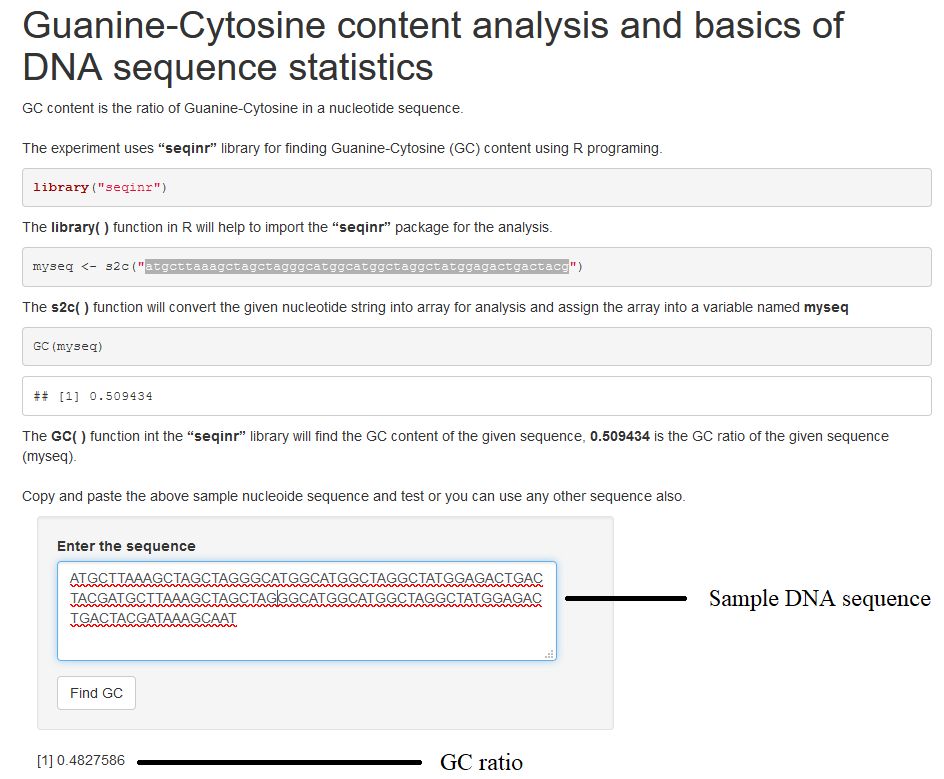

### Procedure
 

&nbsp;

1.	Follow ( https://vlab.amrita.edu/index.php?sub=3&brch=311&sim=1835&cnt=2) to install R in personal computer.
2.	Install sequinR package. Follow the code 

        install.packages('seqinr')
        library('seqinr')
 
&nbsp;

**Procedure to calculate GC content in a personal computer**
 
1.	Follow the code in the command window:

               library("seqinr")
               seq1<-s2c("atgcttaaagctagctagggcatggcatggctaggctatggagactgactacg")
               GC(seq1)
2. Click execute button for output.
 
&nbsp;

***Description***
 
*The experiment uses “seqinr” library for finding Guanine-Cytosine (GC) content in R programing. GC content is the ratio of Guanine-Cytosine in a nucleotide sequence. First line of code is importing the seqinR library into the workspace. The function “s2c” convert the string into an array and assign to a variable named seq1 and the GC( ) function in seqinr library calculates the GC content of the given nucleotide sequence.*
 
&nbsp;

**Procedure to work simulator**
 
1.	Paste any DNA sequence in the textbox provided. Click on “ Find GC” button
2.	GC ratio will be displayed in the GUI.

